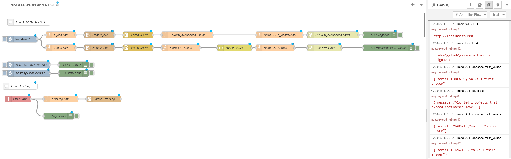
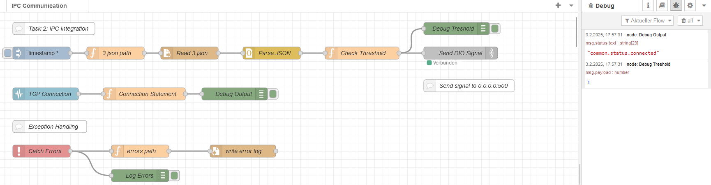
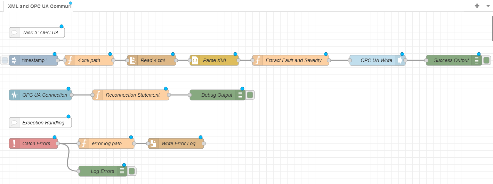

# Vision Automation Engineer Assignment  

This repository contains the solution to the **Vision Automation Engineer take-home assignment**.

The assignment is split into 3 dedicated tasks. The key objectives can be summed up as follows:  
- Task 1: Parsing and processing data from json files and send POST and GET requests to an API endpoint
- Task 2: Communicating with an OPC UA server and sending data to a REST API endpoint
- Task 3: Communicating with an IPC and sending DIO signals via a standardized interface (TCP/IP)
- Ensure Exception handling and logging for maintainability  

---

## 📁 **Project Structure**
```plaintext
├── /                   # raw assignment source data and configuration files
├── endpoints/          # Python helper scripts
├── node-red/           # Node-RED flow files (exported JSON)
├── requirements.txt    # Python dependencies (if applicable)
└── README.md           # Project documentation
```

## 🛠 **Setting up the Project**

1. Clone this repository:
```bash
git clone https://github.com/anmarchio/vision-automation-assignment.git
```

2. Navigate to the project directory:
```bash
cd vision-automation-assignment
```

### Running Node-RED

* For the windows setup, see: https://nodered.org/docs/getting-started/windows
* Download node red from: https://nodejs.org/en/
* Install node red by running the installer
* Open the command prompt and run:
```bash
node-red
```

* Open Node-RED in your browser: http://localhost:1880.
* Import the flows as described below.

#### Additional Nodes

* In the node-red dashboard, go to `Management > Palette Management`
* Choose Installation: `@opcua/for-node-red`
* Click `Install`
* Check if `@opcua/ua-client` shows up under `Installed Nodes`

## 📡 **Running the Assignment**

### Set Environment Variables

* open `management\settings`
* Insert variables by clicking `add`:
  * Insert the path of the root directory on your machine, e.g. as: 
  * `ROOT_PATH`: `<YOUR-DIRECTORY>\vision-automation-assignment`
  * `WEBHOOK`: `localhost:8000`

### Node-Red Exception Handling
* All node-red flows are equipped with catch nodes for structured exception handling
* Exception messages are written to: `errors.log`

### Task 1: JSON parsing and REST API Communication

* Run Python Environment:
```bash
python main.py
``` 
* select `1` to run the uvicorn server on `localhost:8000`
* In node-red, select `management/import`
  * import the json file: `node-red/ipc-communication.json`
  * select `deploy` to run the IPC communication flow

#### Discussion
* The API endpoint has been implemented using FastAPI
* It will accept POST and GET requests from node-red flow
* Since the `1.json` content looks like the output of a object detection model, the serial ids likely refer to a bar code number
* The `POST` request will contain the count of objects exceeding the confidence level of 0.99
* the return statements defined in the python endpoint script are arbitrary, but return a string that matches the serial ids:
```json
{
    "123456": "first answer",
    "654321": "second answer",
    "236326": "third answer"
}
```



### Task 2: IPC Integration

* Run Python Environment:
```bash
python main.py
``` 
* select `2` to run the tcp listener on `localhost:500`
* Import the json file: `node-red/rest-api-communication.json` 
* Click deploy to run the flow
* Execution will then run locally and output should appear in the debug window
  * Check for terminal output
  * Output should show `1` upon execution of the node-red flow

#### Discussion
* As an interface to send DIO signals, a TCP/IP endpoint is used
* Also, the 'signal' will be an integer `1` which would equal a common `ON` signal



### Task 3: OPC UA Communication
* Import the json file: `node-red/opc-ua-communication.json` 
* Check if the opc ua node is active (see instructions to install nodes above)
* Click deploy to run the flow
* Message will be written to: `opc.tcp://opcuademo.sterfive.com:26543/UA/SampleServer` 
* The Message payload sent via OPC UA will look as follows:
```json
{
  severity: "High",
  type: "Surface"
}
```

#### Discussion
* Signals sent to OPC UA are no longer specified, so the message is sent as a JSON object
* Also, the OPC UA Endpoint will simple use the sterfive default endpoint for now
* Of course, for a solid back-and-forth communication, a OPC UA server would need to be set up and configured



## ⚠️ Error Handling
* Node-RED catch nodes for structured exception handling
* Python try/except blocks for resilient data processing

## 📝 **Recommended Improvements**
* Unit testing for python scripts and potentially for node-red
* Containerization for the environment when the specific destination platform is given (raspi, edge PC, linux server)
* Integration with hosted CI/CD pipeline